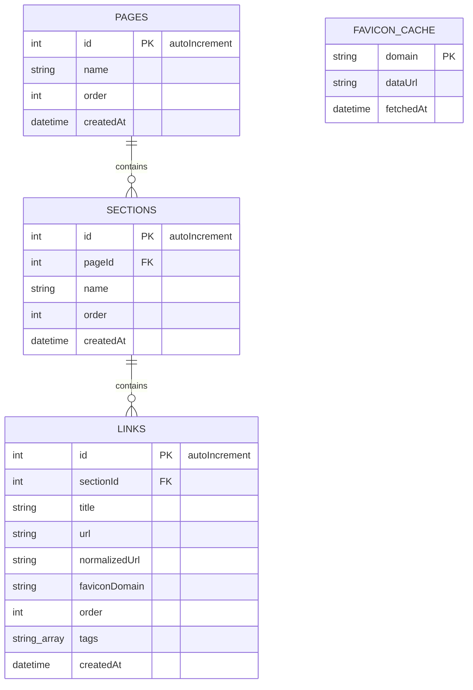

# LinkHub Technical Design Document

This document outlines the architecture, data structures, and design decisions for LinkHub.

## Data Model & Schema

LinkHub uses IndexedDB for client-side storage, managed through the **Dexie.js** library. The database name is `LinkHubDB`.



### Table Specifications
1. **`pages`**:
   - Stores user dashboard sheets.
   - Index: `++id`, `order`.
2. **`sections`**:
   - Stores groups inside a page.
   - Index: `++id`, `pageId`, `order` (Index on `pageId` for efficient query cascading).
3. **`links`**:
   - Stores the bookmark records.
   - Index: `++id`, `sectionId`, `normalizedUrl`, `order`.
   - `normalizedUrl` treats HTTP/HTTPS protocols as identical, ignores default ports (80/443), strips trailing slashes, and lowercases the host.
4. **`faviconCache`**:
   - Caches base64 data URLs by domain to allow instant, offline-capable display.
   - Index: `domain` (PK).

---

## Platform Adapter Layer

To ensure ~95% of the codebase is shared between the standalone web page and the Chrome extension, browser-specific APIs are isolated behind the `PlatformAdapter` interface:

```typescript
export interface PlatformAdapter {
  isExtension: boolean;
  getFaviconUrl(url: string, domain: string): string;
  getCurrentTabUrl(): Promise<string | null>;
}
```

- **Vite Conditional Compilation**: The import of `@platform` is swapped at build time using Vite resolving aliases:
  - Standalone: Resolves to `src/platform/platform.web.ts`.
  - Extension: Resolves to `src/platform/platform.extension.ts`.
- **Extension Resolver**: Uses Chrome's `_favicon` service (`chrome-extension://<id>/_favicon/`), which requires the `"favicon"` permission.
- **Web Resolver**: Falls back to the Google S2 favicon service (`https://www.google.com/s2/favicons`).

---

## Search Indexing Strategy

We use **FlexSearch** for instant client-side searches. 

1. **Rebuild-on-Load**: On application boot (or after full-import operations), we fetch all bookmarks from IndexedDB and populate a FlexSearch index in memory. At a scale of ~500–1000 links, this takes under 5 milliseconds.
2. **No Persistence**: We do not persist the search index in a database table. Serializing and deserializing a search index is slower than rebuilding it from scratch at this scale and adds unnecessary complexity.
3. **Incremental Updates**: Every database mutation wrapper in `src/db/operations.ts` (`addLink`, `updateLink`, `deleteLink`) simultaneously updates the FlexSearch index, ensuring they never drift out of sync.

---

## Import / Export Engine

### Lossless JSON Format
- Exports all `pages`, `sections`, and `links` to a JSON file.
- Recommended for full backups and device switches.

### Netscape Bookmark HTML
- Standard bookmarks format.
- **Export**: Generates nested `<DL>` and `<H3>` folder structures:
  - Page → Top-level `<H3>` folder.
  - Section → Nested `<H3>` folder.
  - Link → `<A HREF>` tag.
- **Import & Flattening Rules**:
  - Outermost folders (e.g. "Bookmarks Bar") become **Pages**.
  - Immediate subfolders become **Sections**.
  - Loose links directly under pages are auto-collected into a section named **"General"**.
  - Folders nested deeper than 2 levels are flattened. Their links are placed in the nearest ancestor section and tagged with the sub-folder path (e.g. `Folder1/Folder2`) to preserve context.

### Merging and Deduplication
Users choose between **Merge** and **Replace** when importing data:
- **Replace**: Destroys current IndexedDB records before inserting.
- **Merge**: 
  - Pages/Sections: Merged by case-insensitive name matching in the same scope (no duplicates like "Bookmarks Bar (2)" are created).
  - Links: Deduplicated by `normalizedUrl`. If it exists anywhere, it is skipped.

---

## Favicon Resolution Chain

To support offline display and maximize rendering efficiency, favicons follow this resolution chain:
1. **Cache lookup**: Check `faviconCache` for a base64 `dataUrl` for the domain.
2. **Platform Resolver**: If not cached, load the platform-specific URL.
3. **Asynchronous Cache Loader**: In the background, fetch the image, convert it to base64, and save it in `faviconCache` for next boot. On the web, if this fails due to CORS, the image is still displayed via the platform URL but not cached as base64.
4. **Visual Fallback**: If both load steps fail, display a styled letter avatar derived from the link title.

---

## Key Architectural Decisions

- **Dexie.js**: We use Dexie instead of raw IndexedDB. Raw IndexedDB requires verbose event listener boilerplate. Dexie provides clean Promise wrappers, transaction safety, and schema version management.
- **`useLiveQuery`**: Instead of TanStack Query (which is built for remote server synchronization, caching, and polling), we use Dexie's native React hook `useLiveQuery`. It binds React render cycles directly to IndexedDB transactions, automatically re-rendering the UI when database records mutate.
- **`@dnd-kit`**: We chose `@dnd-kit` because it is modern, lightweight, supports accessible keyboard sensors, and is fully compatible with React 18/19. Alternatives like `react-beautiful-dnd` are deprecated and lack layout support.
- **`DOMParser` for Netscape HTML**: We use the browser's built-in `DOMParser` rather than dragging in external HTML parsing libraries, keeping our extension bundle sizes lightweight and secure.

---

## Future Work & Out of Scope for v1
- **Save Current Tab Extension Action**: A shortcut popup to save the active browser tab directly into a section.
- **User-Facing Tags Manager**: Ability to search, filter, and organize bookmarks by tags directly in the interface.
- **Broken Link Checker**: Periodic background checks for 404 links.
- **Multi-Widget Dashboards**: Adding weather widgets, markdown notes, or search engines.
